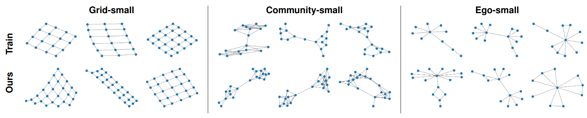

# Graph Recurrent Neural Networks (GraphRNN)

Reproducing results from the paper 
["GraphRNN: Generating Realistic Graphs with Deep Auto-regressive Model"](https://arxiv.org/abs/1802.08773).

## Requirements
The following Python libraries are required:
- `pytorch >= 1.10`
- `tensorboard >= 2.8`
- `networkx >= 2.6.3`
- `pyyaml >= 6.0`
- `pyemd >= 0.5.1`

## Extensions

- We added additional evaluation metrics:
  - Betweenness Centrality
  - Degree Centrality
  - Density
  - Triadic Closure
- We added support for generating directed graphs and a special mode for generating DAGs

## Acknowledgement
The authors' original implementation can be found [here](https://github.com/snap-stanford/GraphRNN).
